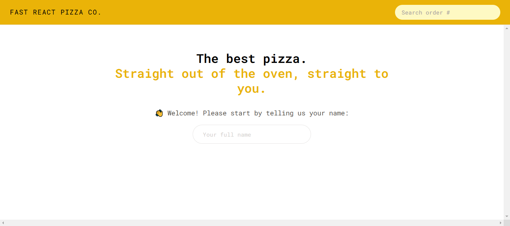
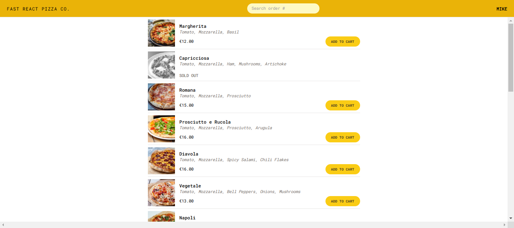
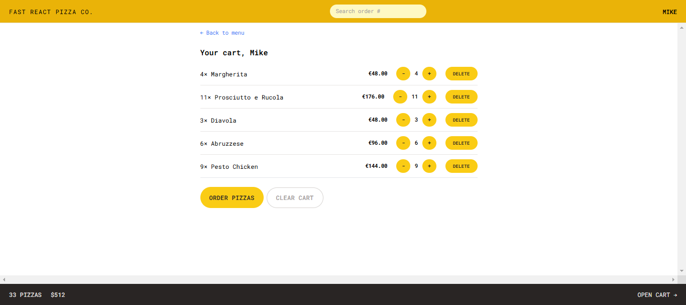
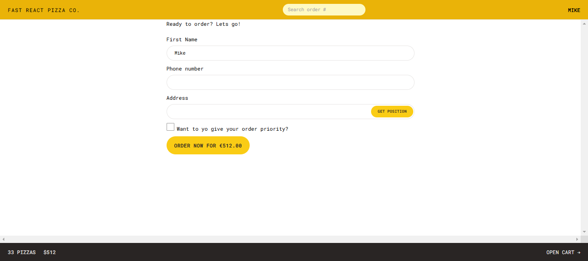
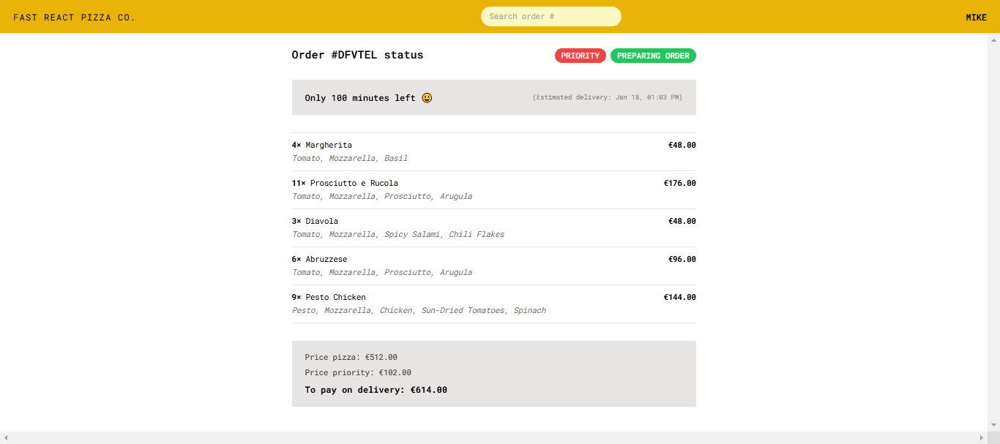

# 🍕 Fast React Pizza Co.

Welcome to **Fast React Pizza Co.**, your ultimate pizza-ordering application! With a sleek design and seamless functionality, this app allows users to explore delicious pizzas, customize their orders, and manage everything effortlessly. Built using React, Redux, and React Router, this application is optimized for speed and usability.

---

- Github Repo: [Github-link](https://github.com/Mikiyas6/Fast-React-Pizza)
- Live Site URL: [Page-link](https://mikiyas6.github.io/Fast-React-Pizza/)

---

## 🚀 Features

### 🔍 Explore the Menu
- Browse a variety of pizzas with all the details you need.
- Ingredient lists and pricing provided for each item.

### 🛒 Shopping Cart
- Add or remove pizzas from the cart with ease.
- View the total price of your order instantly.

### 📋 Order Management
- Fill out your details to place an order quickly.
- Choose to prioritize your order for faster delivery.

### 🧭 Real-Time Navigation
- Use loaders and fetchers for smooth data handling.
- Get real-time updates on your order status.

---

## 🛠️ Technologies Used

- **React**: Component-based UI development.
- **React Router**: For navigation and route management.
- **Redux**: State management for cart and user details.
- **CSS Modules**: Styling for a clean and modular approach.
- **APIs**: Simulated backend for fetching menu items and managing orders.

---

## 📸 Screenshots & Page Details

### 1. **Home Page** 🏠
   

   - Features an inviting introduction to the app.
   - Quick links to browse the menu or manage orders.

### 2. **Menu Page** 🍕

   - Displays a list of all available pizzas.
   - Each pizza card includes:
     - Name and description.
     - Price and available ingredients.
   - Users can add pizzas directly to their cart from this page.

### 3. **Cart Page** 🛒

   - A summary of the pizzas you’ve selected.
   - Ability to:
     - Adjust quantities.
     - Remove items from the cart.
     - View total prices.

### 4. **Order Page** 📝

   - Collects user details such as name, address, and phone number.
   - Allows users to choose priority delivery.
   - Displays the total cost, including priority fees.

### 5. **Order Status Page** 🚚

   - Shows the current status of your order.
   - Provides estimated delivery time.
   - Updates in real-time for a seamless experience.

---

## 🧑‍💻 Installation & Setup

### Prerequisites
Ensure you have the following installed:
- Node.js
- npm or yarn

### Steps
1. Clone the repository:
   ```bash
   git clone https://github.com/Mikiyas6/fast-react-pizza-co.git
   ```
2. Navigate to the project directory:
   ```bash
   cd fast-react-pizza-co
   ```
3. Install dependencies:
   ```bash
   npm install
   # or
   yarn install
   ```
4. Start the development server:
   ```bash
   npm start
   # or
   yarn start
   ```
5. Open your browser and go to `http://localhost:3000` to explore the app.

---

## 🎯 Key Concepts

### 1. **State Management**
   - Redux is used to manage the cart and user data effectively.
   - Selectors like `getCart` and `getTotalCartPrice` simplify state retrieval.

### 2. **Route Management**
   - React Router enables dynamic routing.
   - Loaders fetch data for specific routes, enhancing user experience.

### 3. **Side Effects with `useEffect`**
   - Ensures smooth integration with APIs.
   - Handles dynamic updates, such as fetching menu data in real time.

---

## 🙌 Contributions

Contributions are welcome! If you’d like to contribute:
1. Fork the repository.
2. Create a feature branch:
   ```bash
   git checkout -b feature-name
   ```
3. Commit your changes:
   ```bash
   git commit -m "Add feature"
   ```
4. Push to the branch:
   ```bash
   git push origin feature-name
   ```
5. Open a pull request.

---

## 📬 Contact

If you have any questions, feel free to reach out:
- **Email**: [Mikiyas.Tewodroes@A2SV.org](mailto:Mikiyas.Tewodroes@A2SV.org)
- **GitHub**: [Mikiyas6](https://github.com/Mikiyas6)

---

Enjoy building your pizza empire! 🍕✨


